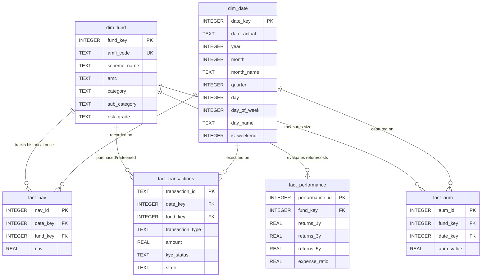

# Data Dictionary - Mutual Fund Analytics Star Schema

This data dictionary outlines the database model, schema configuration, and column metadata for the SQLite-based **Mutual Fund Analytics** database (`mutual_funds.db`).

---

## 📐 Schema Architecture

The database utilizes a **Star Schema** designed for efficient multidimensional reporting and analysis.

---

## 📂 Dimension Tables

### 1. `dim_fund`
Stores metadata and descriptive attributes for mutual fund schemes.

| Column Name | Data Type | Key | Nullable | Business Definition | Source Field / Reference |
| :--- | :--- | :--- | :--- | :--- | :--- |
| `fund_key` | `INTEGER` | `PK` | `No` | Auto-generated surrogate primary key for joining facts. | Generated during ETL |
| `amfi_code` | `TEXT` | `UK` | `No` | Unique 6-digit numeric AMFI identifier for the scheme. | `scheme_code` from master list |
| `scheme_name`| `TEXT` | - | `No` | Full legal name of the mutual fund scheme. | `scheme_name` from raw CSVs |
| `amc` | `TEXT` | - | `No` | Name of the Asset Management Company (AMC) / Fund House. | Extracted from name prefix |
| `category` | `TEXT` | - | `Yes` | High-level asset class category (e.g., Equity, Debt, Hybrid). | Static asset mapping |
| `sub_category`| `TEXT` | - | `Yes` | Specific segment target classification (e.g., Small Cap, ELSS, Money Market). | Static asset mapping |
| `risk_grade` | `TEXT` | - | `Yes` | SEBI risk-o-meter classification label (e.g., Very High, Moderate, Low). | Static risk mapping |

---

### 2. `dim_date`
Converts standard date ranges into descriptive columns for convenient calendar reporting (holidays, weeks, months, quarters).

| Column Name | Data Type | Key | Nullable | Business Definition | Source Reference |
| :--- | :--- | :--- | :--- | :--- | :--- |
| `date_key` | `INTEGER` | `PK` | `No` | Primary key represented as an integer in YYYYMMDD format. | Generated during ETL |
| `date_actual` | `TEXT` | - | `No` | Calendar date in standard string ISO format (`YYYY-MM-DD`). | Original dates |
| `year` | `INTEGER` | - | `No` | Calendar year (e.g., 2026). | Date extraction |
| `month` | `INTEGER` | - | `No` | Numeric month of the year (1 - 12). | Date extraction |
| `month_name` | `TEXT` | - | `No` | Full English name of the month (e.g., January). | Date extraction |
| `quarter` | `INTEGER` | - | `No` | Calendar quarter (1 - 4). | Date extraction |
| `day` | `INTEGER` | - | `No` | Day of the month (1 - 31). | Date extraction |
| `day_of_week` | `INTEGER` | - | `No` | Day index (0 for Monday to 6 for Sunday). | Date extraction |
| `day_name` | `TEXT` | - | `No` | Full name of the weekday (e.g., Monday). | Date extraction |
| `is_weekend` | `INTEGER` | - | `No` | Boolean flag indicating weekends (0 = Weekday, 1 = Weekend). | Calculated from day index |

---

## 📈 Fact Tables

### 3. `fact_nav`
Captures historical daily Net Asset Value (NAV) values. Missing entries on holidays/weekends are forward-filled.

| Column Name | Data Type | Key | Nullable | Business Definition | Source Field / Reference |
| :--- | :--- | :--- | :--- | :--- | :--- |
| `nav_id` | `INTEGER` | `PK` | `No` | Auto-generated surrogate primary key. | Generated during ETL |
| `date_key` | `INTEGER` | `FK` | `No` | Link to target date record in `dim_date`. | Map from transaction date |
| `fund_key` | `INTEGER` | `FK` | `No` | Link to target fund record in `dim_fund`. | Map from `amfi_code` |
| `nav` | `REAL` | - | `No` | Price per unit of the scheme on this date in INR. | `nav` from NAV raw files |

---

### 4. `fact_transactions`
Tracks investment transactions (purchases and redemptions) processed by investors.

| Column Name | Data Type | Key | Nullable | Business Definition | Source Field / Reference |
| :--- | :--- | :--- | :--- | :--- | :--- |
| `transaction_id`| `TEXT` | `PK` | `No` | Unique transaction reference code (e.g. `TXN00001`). | `transaction_id` from transactions |
| `date_key` | `INTEGER` | `FK` | `No` | Link to target date record in `dim_date`. | Map from transaction date |
| `fund_key` | `INTEGER` | `FK` | `No` | Link to target fund record in `dim_fund`. | Map from `amfi_code` |
| `transaction_type`| `TEXT` | - | `No` | Standard transaction class category (`SIP`, `Lumpsum`, `Redemption`). | `transaction_type` cleaned |
| `amount` | `REAL` | - | `No` | Monetary value of the transaction in INR (strictly positive). | `amount` cleaned |
| `kyc_status` | `TEXT` | - | `No` | Standardized KYC regulatory status (`Verified`, `Pending`, `Failed`). | `kyc_status` cleaned |
| `state` | `TEXT` | - | `No` | Indian state name where the transaction originated. | `state` from transactions |

---

### 5. `fact_performance`
Stores performance returns and costs details for funds.

| Column Name | Data Type | Key | Nullable | Business Definition | Source Field / Reference |
| :--- | :--- | :--- | :--- | :--- | :--- |
| `performance_id`| `INTEGER` | `PK` | `No` | Auto-generated surrogate primary key. | Generated during ETL |
| `fund_key` | `INTEGER` | `FK` | `No` | Link to target fund record in `dim_fund`. | Map from `amfi_code` |
| `returns_1y` | `REAL` | - | `Yes` | 1-Year trailing returns as a percentage value (e.g. `12.5` for 12.5%). | `returns_1y` cleaned |
| `returns_3y` | `REAL` | - | `Yes` | 3-Year trailing returns as a percentage value (e.g. `14.8` for 14.8%). | `returns_3y` cleaned |
| `returns_5y` | `REAL` | - | `Yes` | 5-Year trailing returns as a percentage value (e.g. `11.2` for 11.2%). | `returns_5y` cleaned |
| `expense_ratio`| `REAL` | - | `Yes` | Scheme management expense ratio stored as a decimal (e.g. `0.012` for 1.2%). | `expense_ratio` cleaned |

---

### 6. `fact_aum`
Stores assets under management (AUM) values captured at current snapshot reporting times.

| Column Name | Data Type | Key | Nullable | Business Definition | Source Reference |
| :--- | :--- | :--- | :--- | :--- | :--- |
| `aum_id` | `INTEGER` | `PK` | `No` | Auto-generated surrogate primary key. | Generated during ETL |
| `fund_key` | `INTEGER` | `FK` | `No` | Link to target fund record in `dim_fund`. | Map from `amfi_code` |
| `date_key` | `INTEGER` | `FK` | `No` | Link to target date record in `dim_date` representing snapshot date. | Map from max date in dataset |
| `aum_value` | `REAL` | - | `No` | Total Assets Under Management in Crores INR (1 Crore = 10 Million). | `aum_crores` from performance file |
